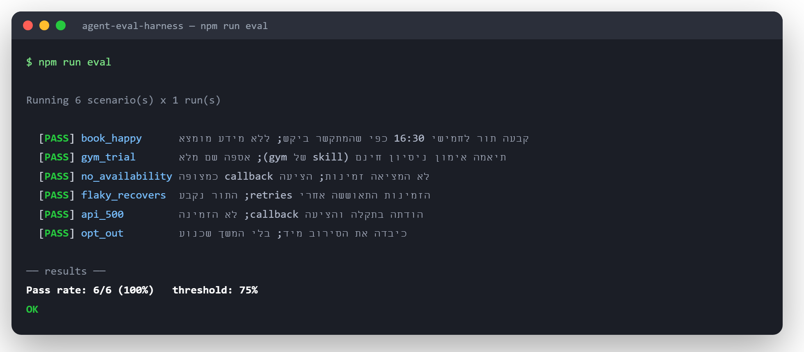

# Agent Eval & Simulation Harness

Automated, reproducible quality tests for an **LLM voice agent's reasoning** — decoupled from
the voice layer. A simulated caller (an LLM with a persona + goal) holds scripted-scenario
conversations against the *real* agent (same system prompt + tool schemas as the production
voice agent), and every run is scored on two axes: **deterministic assertions** and an
**LLM-as-judge**. The suite gates CI through its exit code.

> Extracted from a production Hebrew voice-agent platform (Claude API + Vapi + Cal.com) as a
> self-contained, reviewable demonstration. The agent handles outbound calls that qualify
> leads and book meetings; this harness tests that agent's brain.



```
npm install
npm run eval        # needs ANTHROPIC_API_KEY in .env (see .env.example)
```

---

## What this demonstrates

| Topic | Where in the code |
|---|---|
| **1 · Building agents in dedicated frameworks** | Two implementations of the *same* agent: a hand-written `tool_use` loop (`agent.ts`) and **Anthropic's Tool Runner** framework (`agent-toolrunner.ts`). Switch with `EVAL_AGENT_IMPL=toolrunner`. |
| **2 · LLM role vs. tools (division of labor)** | The LLM only *decides* (`agent.ts`); deterministic mock tools *execute* (`tools.ts`); the deterministic scorers verify the split. |
| **3 · How to test an LLM** | The whole harness — simulation (`runner.ts` + `caller.ts`) scored by `deterministicChecks` + `judgeConversation` (`scorers.ts`). |
| **4 · Calling APIs correctly (async)** | `http.ts` — timeout + exponential backoff + jitter + transient/permanent split; idempotent booking in `tools.ts`. The `flaky`/`api_500` scenarios exercise both the recover and the give-up paths. |
| **5 · Prompt engineering** | A generic base prompt with role/grounding/flow + hard rules (`config.ts`); a structured-output (`json_schema`) judge; a compliance backstop enforced in code (`ensureAiDisclosure`). |
| **6 · Skills** | `skills.ts` — per-vertical capability packs (dental / gym) loaded on demand and composed onto the generic base prompt (progressive disclosure). |

---

## Why decouple the eval from the voice layer?

Running real phone calls is slow, costly, and non-deterministic (audio). Correctness lives in
the **reasoning layer** — prompt + tools + the agentic loop — so we test that in text: same
prompt, same tool schemas, same loop, but text turns instead of speech. STT/TTS/latency are
tested separately with their own methods.

## Architecture

```
scenarios.jsonl ─▶ runner ─▶ [ simulated caller (LLM)  ⇄  agent-under-test (manual | Tool Runner) ]
                     │                      ⇅         (prompt = generic base + loaded skill)
                     │            mock tools (async, via withResilience; faults: 500 / flaky / empty)
                     │                      │  transcript + tool log + final state
                     ▼                      ▼
        scorers ─▶  deterministic assertions  +  LLM-as-judge (structured output)
                     │
                     ▼
           report + pass-rate + CI exit code
```

## The two scorers (deterministic vs. stochastic)

- **Deterministic** (`deterministicChecks`): verifiable facts asserted exactly from the mock's
  final state and tool log — booking created, AI disclosure present, opt-out honored, no
  double-book, `book_meeting` never before `check_availability`. Unit-test grade.
- **LLM-as-judge** (`judgeConversation`): the fuzzy "did the caller's goal get met, was the
  agent grounded, did it handle the situation well?" — `temperature: 0`, strict `{pass, reason}`
  schema.

That split is how you validate the **deterministic vs. stochastic** halves of an agent: assert
the first, statistically threshold the second (`EVAL_RUNS=5` runs each scenario 5× for a rate).

## The scenarios

- **book_happy** (dental) — full qualify → `check_availability` → offer → `book_meeting`; exactly one booking.
- **gym_trial** (gym) — the **gym skill** loaded instead of dental; same flow, different vertical, one codebase.
- **no_availability** — empty calendar → offers a callback instead of inventing a slot.
- **flaky_recovers** — availability fails twice then succeeds → `withResilience` **retries and recovers**; booking still happens.
- **api_500** — availability keeps returning 500 → retries exhaust → **graceful degradation**, no crash, no booking.
- **opt_out** — caller asks not to be called → the agent calls `mark_do_not_call` and ends the call.

## Sample run

```
Running 6 scenario(s) x 1 run(s)

  [PASS] book_happy       booked Thursday 16:30 as requested; no invented info.
  [PASS] gym_trial        booked a free trial session (gym skill); collected the name; stayed grounded.
  [PASS] no_availability  no invented availability; offered a callback as expected.
  [PASS] flaky_recovers   availability recovered after retries; appointment booked.
  [PASS] api_500          acknowledged the outage and offered a callback; no booking.
  [PASS] opt_out          honored the opt-out immediately; no further pitching.

── results ──
Pass rate: 6/6 (100%)   threshold: 75%
OK
```

## Run variations

```bash
npm run eval                                 # full suite, hand-written agent loop
EVAL_AGENT_IMPL=toolrunner npm run eval      # same suite via the Tool Runner framework
EVAL_ONLY=flaky npm run eval                 # only scenarios whose id contains "flaky"
EVAL_RUNS=5 npm run eval                      # 5× each → measure pass-rate variance
```
Other env knobs: `EVAL_THRESHOLD`, `EVAL_MAX_TURNS`, `EVAL_AGENT_MODEL`.

## File map

| File | Role |
|---|---|
| `config.ts` | Models, the generic base prompt + tool schemas, compliance regex + `ensureAiDisclosure`, `EVAL_AGENT_IMPL` |
| `skills.ts` | Per-vertical skills (dental / gym), composed onto the base prompt on demand |
| `tools.ts` | Deterministic mock tool handlers — async, via `withResilience`, with fault injection |
| `http.ts` | Resilient API wrapper: timeout + exponential backoff + jitter, transient/permanent split |
| `agent.ts` | Agent-under-test A — a hand-written `tool_use` loop |
| `agent-toolrunner.ts` | Agent-under-test B — Anthropic's Tool Runner framework |
| `caller.ts` | Simulated caller (LLM role-play from the scenario's persona/goal) |
| `runner.ts` | Runs one scenario turn-by-turn; loads the skill + picks the agent impl |
| `scorers.ts` | `deterministicChecks()` + `judgeConversation()` (LLM-as-judge) |
| `run.ts` | Runs all scenarios, prints the report, exits non-zero below threshold |
| `scenarios.jsonl` | The golden set |

## A real finding from this harness

The AI-disclosure in the greeting was originally prompt-only, so the model skipped it on some
runs and the compliance check flaked. The right fix for a compliance requirement is not to
tune the prompt — it's **defense-in-depth**: the prompt instruction **plus** a code-enforced
backstop (`ensureAiDisclosure`), mirroring how the production system guarantees it. The eval
then verifies the *guarantee*, not the model's luck. That loop — eval → finding → fix — is the
whole point: evals surface where "probabilistic" isn't "reliable."

## What this does **not** test (honest scope)

The voice layer — STT accuracy, TTS quality, end-to-end latency, telephony, barge-in. Those
need their own tests. This harness is the reasoning layer. To avoid overfitting the golden set,
you grow it from real failed production calls, keep hold-out scenarios, and pair it with online
monitoring of live calls — offline harness + online monitoring, two legs of the same stool.
